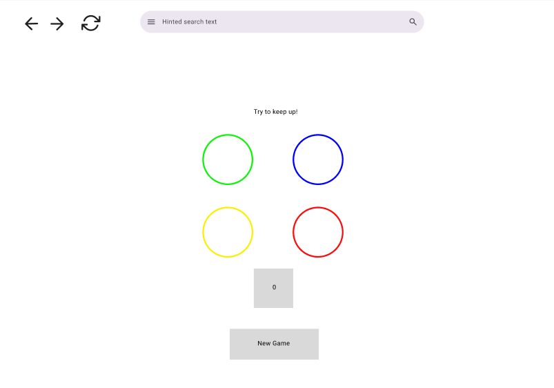
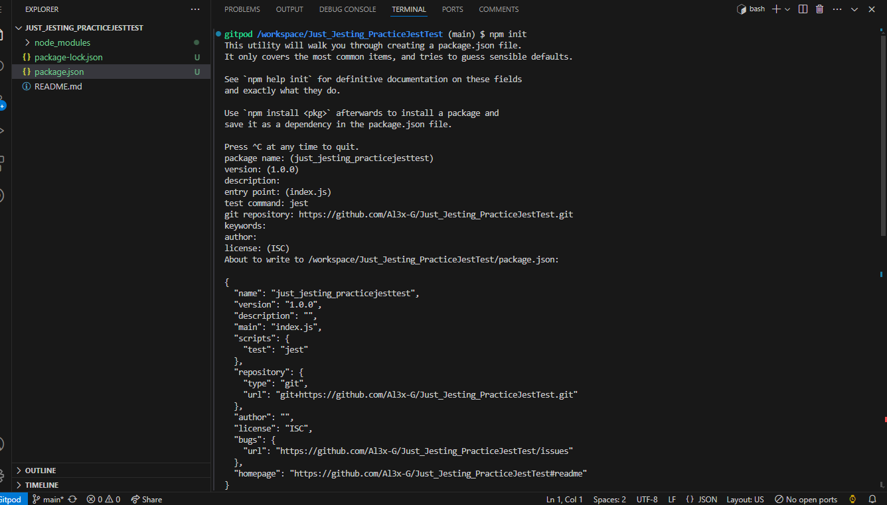
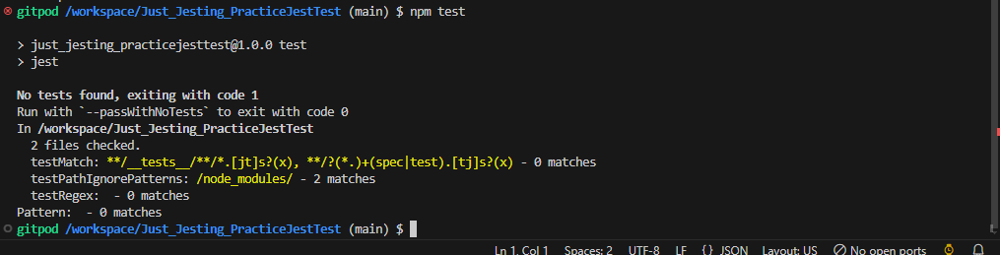
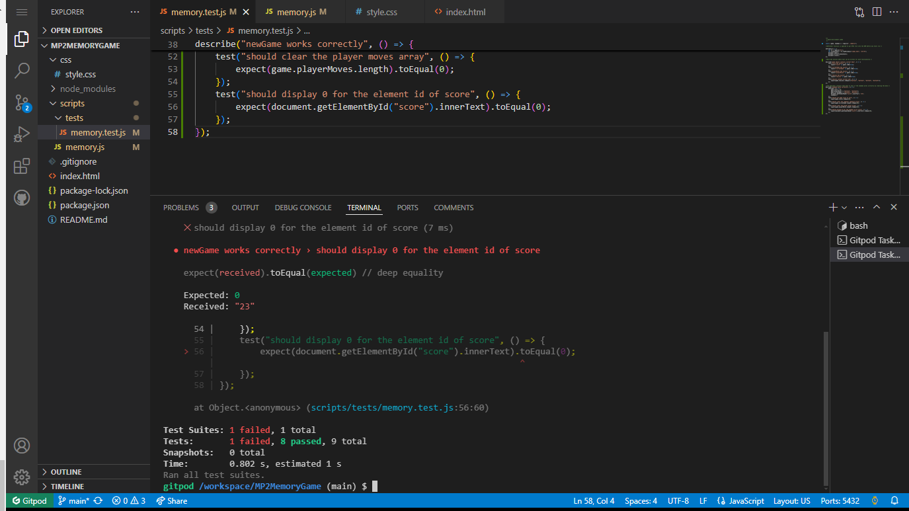
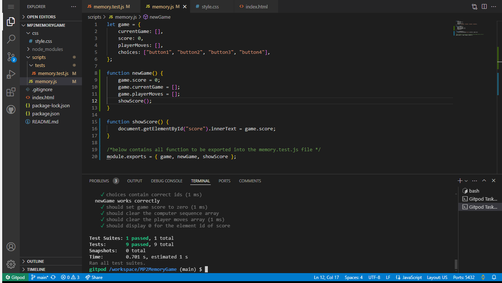
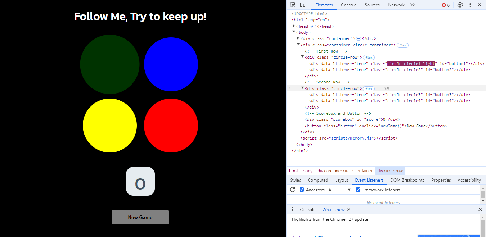
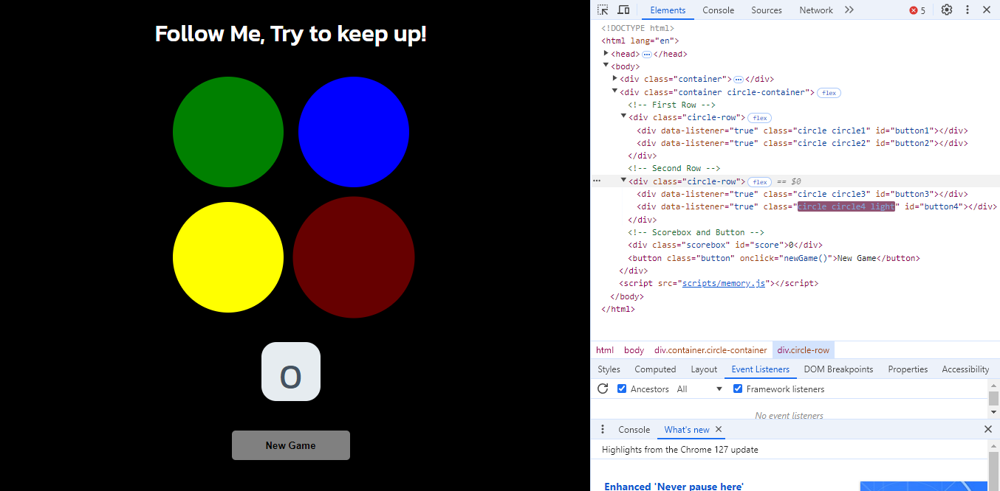
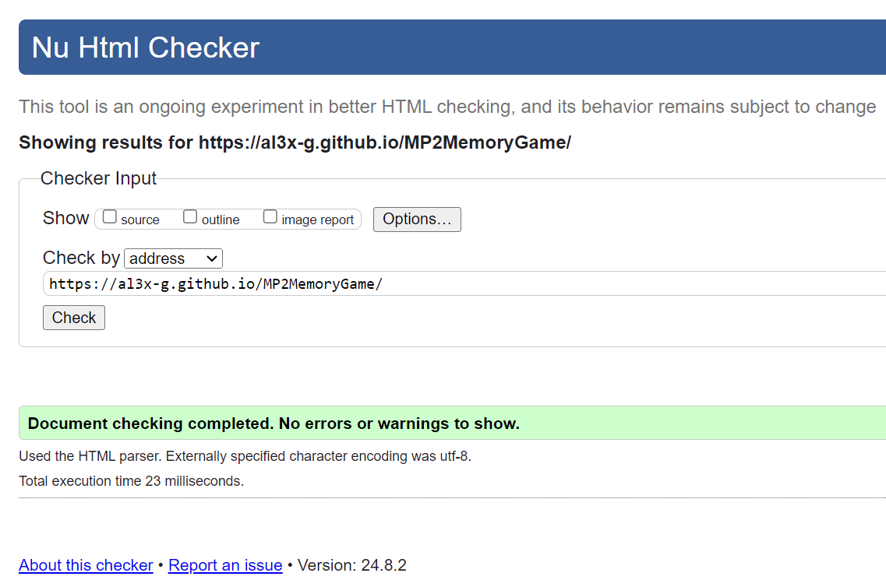

# Memory Game by Alex Gordon

## Content List
- [A Javascript Game](#a-javascript-game)
- [Game concept](#game-concept)
- [User Story](#user-story)
- [Features and Wireframe](#features-and-wireframe)
- [Technology](#technology)
- [Testing](#testing)
- [Code Validation](#code-validation)
- [Deployment and Local Development](#deployment-and-local-development)
- [Credits](#credits)

## A JavaScript Game

This is a website designed to deliver a JavaScript game to the user. 

This game is accessible to all, and has two aims in mind: to be fun to play the first time, and to encourage replayability.

 There is a high score function that stores the longest run score, enabling replayability. The site is targeted primarily at anyone who wishes to play the game, and exists solely for this game. 
 
The game will be designed to work on all screens, and should be responsive as the page is resized. 

The site is designed to work on any device with a mouse pointer. During developement an issue was found with using touch screen devices, due to schedule constraints this was not resolved as the code would have to have be rewritten ideally in a more user freindly framework. The future plan is to take this project and extend it to more devices.

## Game Concept
With inspiration drawn from the very succesful game Simon. Which is an electronic game of short-term memory skill invented by Ralph H. Baer and Howard J. Morrison, working for toy design firm Marvin Glass and Associates, with software programming by Lenny Cope. First brought to market in 1978, The device created a series of tones and lights and required a user to repeat the sequence. If the user succeeds, the series becomes progressively longer and more complex. Once the user fails or the time limit runs out, the game is over.

A note about copyright: This game is intended as a parody of Simon, which is © Hasbro, and is in no way designed to infringe on the copyright of Simon. This game is not made for the purposes of making money, and all rights to the game Simon and to the mechanics that are represented under the copyright remain the property of the copyright owner.

## User Story
As a player:
+ An enjoyable gameplay loop
+ Strong visuals that help focus the user on gameplay
+ Clear feedback on whether I have performed a game action
+ Bug-free gameplay
+ Some ability to measure my performance
+ Replayability options and value

## Features and Wireframe
This site comprises one page, with a centred game screen. A simple approach is usually best, I opted for a dark background and for the interactive elements to be bright and noticeable.

### Title Page

It was during this stage that I opted for a dark background, The wireframe shows, that a white background is not the best for depicting colours and is too bright for the user.

## Technology
+ This website was made in its entirety using Visual Code Studio
+ Wireframe were made in Figma
+ Additional software used to create this website include Chrome for previewing, inspecting and bug testing
+ Code languages used in this project are as follows:
    + HTML for the structure of the webpage 
    + CSS for the styling 
    + Javavscript for the interactivity 
    + Jest for the testing environment.

## Testing

### Test Case : Jest

At the very start of this project, I implemented jest into my work environment to practice how to test code as I was writing it using a Test Driven Developement approach. 

I did this using the package manager to install.

Below is the method used to do this:

(Note that these are taken from a separate test environment, this was to make sure I could understand it before I added it to my project)

I then ran the command 'npm test'

As expected, There was no tests found as at this point no code had been written but I could now be sure the jest had been installed and was working correctly.

### Test Case: TDD Developement

Test-driven development (TDD) is a way of writing code that involves writing an automated unit-level test case that fails, then writing just enough code to make the test pass, then refactoring both the test code and the production code, then repeating with another new test case.

Below are some examples of an TDD developement approach in this project:

This first example shows an error for the newGame function, the element with and ID of score should display 0 but instead shows 23. this was just dummy data I added, for this game to work, once someone starts a new game the score should reset to zero.

The solution to passing this test is shown below on code line 9:

Every function in this project has gone through this process and can be seen through the git commit stages of this project and on the comments in the code itself, memory.test.js and memory.js.

### Test Case: Developer tools

below are a few rules I laid out as a basic framework to follow when planning the project. 

Once the game was complete I used chrome developer tools to test that these rules were adhered to.

+ Click outside game space; should have no effect on game.

+ The game space should have 4 equal sized circles that the user can click and is obvious when clicked.

+ The game space should also have a new game button.

+ When the game is active: The highscore box should add up for every correct sequence.

+ When the game is active: the circle should light up clearly to the user.

+ When the game is active: there should be enough time between each light up of the circles. 

+ When the game is active: If the incorrect button is pressed then the alert box should show displaying a message such as "Try again!" and a new game starts.

Below are a few example of these tests being done:

### Bugs discovered
+ Properly aligning the circle buttons was very important as this was the main interaction with the user. Ultimately I solved this with putting two circles on a row each instead of trying to align them in one section.

+ I had to change the alignment for smaller screens. 
 Upon doing this led to alignment issues, but fixed with flex direction: column in the body CSS.

+ I had to change the hover function as it didnt look right on touch screens. I did this by disabling hover effect on touch devices using media querie in css.

+ Alot of issues arose when trying to use touch screens on various mobile devices. Due to strict scheduling deadlines i opted for a mainly desktop with mouse pointer oriented game and then in the next iteration I would perfect the code for touch devices.

## Code validation
I used <a href="https://validator.w3.org/" target="_blank">W3C</a> to validate my code.

### Lighthouse Report:

 

### <a href="https://jshint.com/" target="_blank">JSHint</a>

 

## Deployment and Local Development

### Deployment

The site is deployed using GitHub Pages - [Al3x-G/MP2MemoryGame](https://github.com/Al3x-G/MP2MemoryGame).

To Deploy the site using GitHub Pages:

1. Login (or signup) to Github.
2. Go to the repository for this project, [Al3x-G/MP2MemoryGame](https://github.com/Al3x-G/MP2MemoryGame).
3. Click the settings button.
4. Select pages in the left-hand navigation menu.
5. From the source dropdown select main branch and press save.
6. The site has now been deployed, please note that this process may take a few minutes before the site goes live.

### Local Development

#### How to Fork

To fork the repository:

1. Log in (or sign up) to Github.
2. Go to the repository for this project, [Al3x-G/MP2MemoryGame](https://github.com/Al3x-G/MP2MemoryGame).
3. Click the Fork button in the top right corner.

#### How to Clone

To clone the repository:

1. Log in (or sign up) to GitHub.
2. Go to the repository for this project, [Al3x-G/MP2MemoryGame](https://github.com/Al3x-G/MP2MemoryGame).
3. Click on the code button, select whether you would like to clone with HTTPS, SSH or GitHub CLI and copy the link shown.
4. Open the terminal in your code editor and change the current working directory to the location you want to use for the cloned directory.
5. Type 'git clone' into the terminal and then paste the link you copied in step 3. Press enter.

The Visual Studio Code preview extension was used to preview the website. To open this repository on Visual Studio Code:

+ Open an integrated terminal from the menu Terminal -> New Terminal
+ Clone the repo with the following command: git clone https://github.com/Al3x-G/MP2MemoryGame
+ Change your terminal into that new subdirectory: cd mp2memorygame
+ Open in Visual Studio Code: code .

## Credits
### Text Content
Text is written by the Al3x-G https://github.com/Al3x-G

### Code

All code was written by Alex Gordon working alongside Code Institute for support and guidance.

